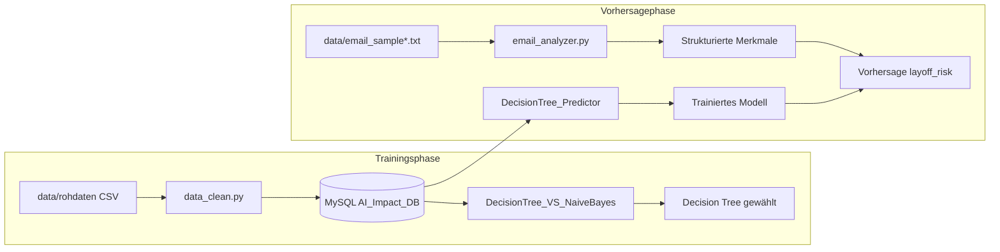

# Beschreibung der ML- und LLM-Module

**Abgedeckte Module:** `DecisionTree_Predictor` · `DecisionTree_VS_NaiveBayes` · `email_analyzer`

---

## 1. Projektbeschreibung

**Jobs-Layoff-Risk** ist ein kompaktes Machine-Learning-System zur Bewertung des Entlassungsrisikos (`layoff_risk`) von Mitarbeitenden. Das System liest Mitarbeiter- und Stellenmerkmale aus einer MySQL-Datenbank, trainiert Klassifikationsmodelle und wandelt unstrukturierte E-Mail-Texte mithilfe eines Large Language Models (LLM) in strukturierte Merkmale um, die direkt für Vorhersagen genutzt werden können.

### Eingaben

**Kategoriale Merkmale (6 Spalten):**

`education_level`, `industry_name`, `job_role_name`, `company_size`, `job_level`, `ai_adoption_level`

**Numerische Merkmale (9 Spalten):**

`age`, `years_of_experience`, `routine_task_percentage`, `creativity_requirement`, `human_interaction_level`, `number_of_ai_tools_used`, `ai_usage_hours_per_week`, `tasks_automated_percentage`, `ai_training_hours`

### Ausgabe

**Zielvariable:** `layoff_risk` — drei Klassen: `Low`, `Medium`, `High`

### Technologiebereiche

| Bereich | Technologie |
|---------|-------------|
| Datenbank & Verarbeitung | MySQL, pandas, SQL |
| Machine Learning | scikit-learn (Decision Tree, Naive Bayes) |
| LLM-Extraktion | HuggingFace Inference API — `meta-llama/Llama-3.3-70B-Instruct` |

---

## 2. Technologie-Stack

| Komponente | Bibliothek / Tool |
|------------|-------------------|
| Datenverarbeitung | pandas, numpy |
| Statistik (Vorstufe) | scipy, statsmodels |
| Machine Learning | scikit-learn |
| Datenbank | mysql-connector-python |
| LLM-API | huggingface-hub |
| Visualisierung | matplotlib, seaborn |

Python-Abhängigkeiten: siehe `requirements.txt` im Projektroot.

---

## 3. Systemarchitektur und Datenfluss

Das System durchläuft zwei Hauptphasen:

1. **Trainings- und Evaluierungsphase** — historische Daten aus MySQL
2. **Vorhersagephase** — neue, unstrukturierte E-Mail-Daten

**Architektur-Entscheidung:** Nach dem Vergleich von Decision Tree und Naive Bayes wird der **Decision Tree** als finales Modell für Vorhersagen auf neuen Daten verwendet (bessere Interpretierbarkeit und vergleichbare Genauigkeit im Vollmerkmals-Setup).



### Machine-Learning-Pipeline

```
Rohdaten (MySQL)
    ↓  SQL-Join (employees + Lookup-Tabellen + ai_impact_metrics)
pandas DataFrame
    ↓  train_test_split (80 % / 20 %, random_state=42)
ColumnTransformer
    ├── OneHotEncoder  → kategoriale Merkmale
    └── passthrough    → numerische Merkmale
    ↓
Klassifikator (DecisionTreeClassifier oder GaussianNB)
    ↓
Vorhersage: Low | Medium | High
```

**Decision Tree — Hyperparameter:**

- `max_depth=3`
- `min_samples_leaf=10`
- `random_state=42`

---

## 4. Methodik des Modellvergleichs

**Modul:** `src/ml_model/DecisionTree_VS_NaiveBayes.py`

Beide Modelle werden mit **derselben Trainings-/Testaufteilung** und **vier Feature-Kombinationen** verglichen:

| Szenario | Merkmale |
|----------|----------|
| `accuracy_routine` | nur `routine_task_percentage` |
| `accuracy_interaction` | nur `human_interaction_level` |
| `accuracy_both` | beide Merkmale oben |
| `accuracy_all` | alle 15 Merkmale (6 kategorial + 9 numerisch) |

**Evaluierungsmetrik:** Accuracy (`sklearn.metrics.accuracy_score`) auf dem Testsplit (20 %).

**Zusätzlich:** Beide trainierten Vollmodelle (`accuracy_all`) werden auf drei fest codierte Beispielzeilen angewendet und die Vorhersagen ausgegeben.

### Modellvergleichsergebnis

Die konkreten Accuracy-Werte werden beim Ausführen des Moduls berechnet und im Terminal ausgegeben:

```bash
python -m src.ml_model.DecisionTree_VS_NaiveBayes
```

Typische Beobachtung: Mit nur einem oder zwei Merkmalen ist die Genauigkeit deutlich niedriger; mit allen 15 Merkmalen erreichen beide Modelle die höchste Accuracy. Der Decision Tree wird für die Produktionsvorhersage gewählt, da er die Entscheidungsregeln visuell nachvollziehbar macht (`decision_tree_visualization.py`).

---

## 5. E-Mail-Inhalt analysieren mit LLM

**Modul:** `src/ml_model/email_analyzer.py`  
**Funktion:** `huggingface_llama(email_filename)`

### Ablauf

1. E-Mail-Text aus `data/<email_filename>` laden (`load_data_email`)
2. Text an **Llama-3.3-70B-Instruct** senden (HuggingFace Inference API)
3. LLM extrahiert 15 Felder als **JSON-Objekt**
4. JSON wird in ein pandas-DataFrame umgewandelt
5. DataFrame dient als Eingabe für `DecisionTree_Predictor`

### Anforderungen an die LLM-Ausgabe

- Nur ein gültiges JSON-Objekt, keine Markdown-Hülle
- Fehlende Strings → `""`, fehlende Zahlen → `-1.0`
- Werte in Englisch normalisieren
- Felder entsprechen exakt den Spaltennamen des ML-Modells

### Verfügbare Test-E-Mails

| Datei | Beschreibung |
|-------|--------------|
| `data/email_sample01.txt` | Beispiel-E-Mail 1 |
| `data/email_sample02.txt` | Beispiel-E-Mail 2 (Standard in `DecisionTree_Predictor`) |

---


## 6. Modulübersicht

| Datei | Aufgabe |
|-------|---------|
| `DecisionTree_VS_NaiveBayes.py` | Lädt DB-Daten, vergleicht DT vs. NB, gibt Accuracy aus |
| `DecisionTree_Predictor.py` | Trainiert DT, kombiniert LLM-Extraktion + Vorhersage |
| `email_analyzer.py` | LLM-basierte Merkmalsextraktion aus E-Mail-Text |
| `decision_tree_visualization.py` | Grafische Darstellung des trainierten Baums |
